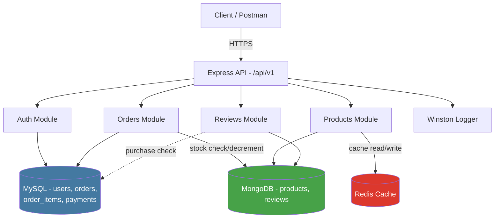

# CommerceCore-API
Backend-only REST API for a mini e-commerce system — Node.js, Express, MySQL &amp; MongoDB, with ACID-safe order transactions, JWT auth, Redis caching, and Docker setup.

## Architecture

